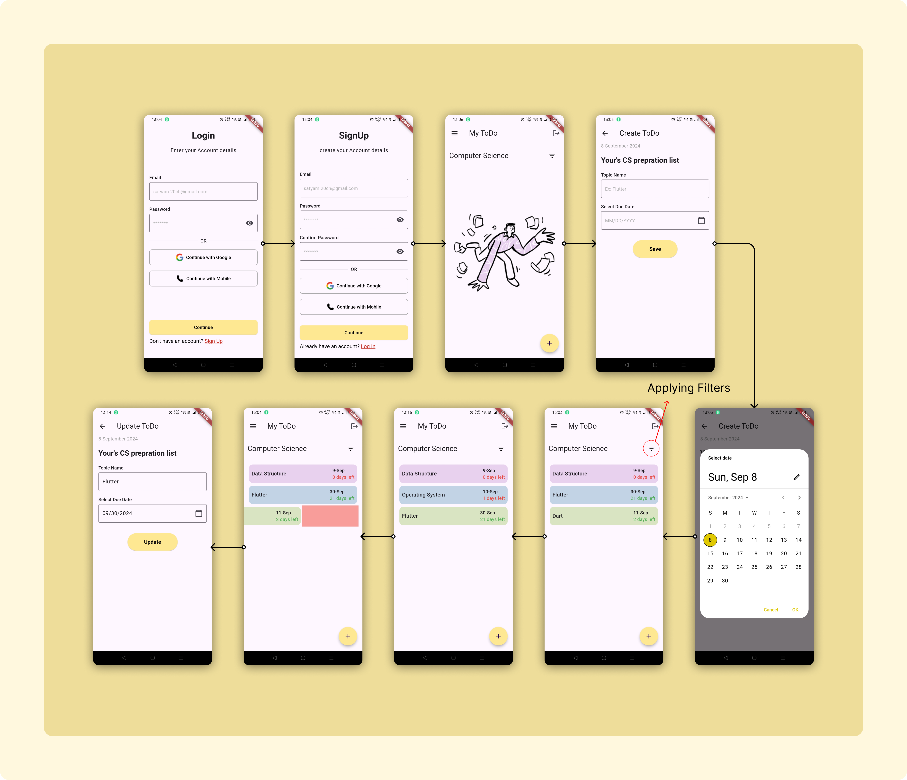

# TODO

A list of topics to learn various CS subjects for semester exam preparation.

## Look & Feel

## Getting Started

1. **Clone the repository:**
    ```bash
    git clone https://github.com/satyam1560/bitcot_assignment_todo.git
    cd todo
    flutter pub get
    ```

2. **Supported Platforms:**
    - Android
    - iOS

3. **Run the application:**
    ```bash
    flutter run -d android
    flutter run -d ios
    ```

4. **Download the build APK file from:**
    [TODO .apk Download](https://drive.google.com/file/d/1dwcWRGj9jmKXEFVJKEiER5dbPz1G0HIM/view?usp=sharing)


## Features Used
- Bloc-State management
- Delete ToDo
- Update ToDo
- Filter ToDo
- Signin
- Create Account
- Logout Account


